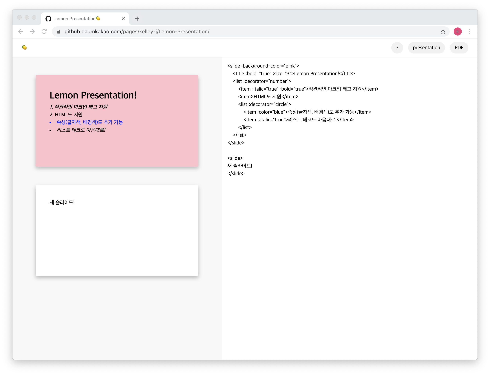

# Welcome to Lemon Presentation 🍋 

> 2020 카카오 여름 인턴십 프로젝트, 웹 기반 프레젠테이션 툴 제작

🏠 [Homepage](https://github.daumkakao.com/pages/kelley-j/Lemon-Presentation)


## ✨ Lemon Presentation



✔️ 일반 사용자를 위해 [새롭게 정의한 마크업 태그](#usage)를 제공합니다.

✔️ HTML 문법을 사용하는 것도 가능합니다.

✔️ 기본적으로 `제목`, `텍스트`, `이미지`, `리스트` 태그를 지원합니다.


## Setup

```shell
npm install
npm run watch
```


## Usage


- 직관적인 태그를 제공하여, HTML을 모르는 사용자도 사용이 가능하도록 만들었습니다.
- 아래 내용을 복사하여 에디터에 넣어보세요!

```
<slide :background-color="pink">
    <title :bold="true" :size="3">Lemon Presentation!</title>
    <list :decorator="number">
        <item :italic="true" :bold="true">직관적인 마크업 태그 지원</item>
        <item>HTML도 지원</item>
        <list :decorator="circle">
            <item :color="blue">속성(글자색, 배경색)도 추가 가능</item>
            <item  :italic="true">리스트 데코도 마음대로!</item>
        </list>
    </list>
</slide>
```


#### 1) 슬라이드

- `slide` 태그로 감싸진 영역은 하나의 슬라이드로 변환됩니다.

```
<slide :background-color="red">
	<title>this is title</title>
</slide>
```

| 속성             | 값                               | 기본값 | 설명    |
| ---------------- | -------------------------------- | ------ | ------- |
| background-color | HEX code(#00ff00), rgb(00,ff,00) | white  | 배경 색 |
| color            | HEX code(#00ff00), rgb(00,ff,00) | black  | 글자 색 |

> HTML로 사용하고 싶다면 아래처럼 작성하세요.
>
> - 반드시 `class="slide"`를 명시해야 합니다.
>
> ```
> <div class="slide" :background-color="red">
> 	<title>this is title</title>
> </div>
> ```


#### 2) 제목

- HTML에서 `h1`, `h2`, `h3`, `h4`, `h5`, `h6` 태그를 의미하며 아래처럼 작성 가능합니다.

```text
<title :size="1" :bold="true" :italic="false">
this is title!
</title>
```

| 속성   | 값                               | 기본값 | 설명      |
| ------ | -------------------------------- | ------ | --------- |
| size   | 1 <= size <= 6                   | 1      | 글자 크기 |
| color  | HEX code(#00ff00), rgb(00,ff,00) | black  | 글자 색   |
| bold   | true, false                      | false  | 볼드체    |
| italic | true, false                      | false  | 이텔릭체  |


#### 3) 텍스트

- `p` 태그에 해당하는 내용으로 `<text>`태그를 사용하지 않아도 됩니다. 다만, `<text>`태그를 사용하면 여러 속성을 추가할 수 있습니다.

```text
<text :color="red">
this is text
</text>
```

| 속성   | 값                               | 기본값 | 설명      |
| ------ | -------------------------------- | ------ | --------- |
| size   | 1 <= size <= 6                   | 1      | 글자 크기 |
| color  | HEX code(#00ff00), rgb(00,ff,00) | black  | 글자 색   |
| bold   | true, false                      | false  | 볼드체    |
| italic | true, false                      | false  | 이텔릭체  |


#### 4) 이미지

- `img` 태그도 사용이 가능합니다.

```text
<image :path="{image path}"></image>
```

| 속성   | 값                  | 기본값 | 설명        |
| ------ | ------------------- | ------ | ----------- |
| width  | 0 ~ 100%            | 100%   | 이미지 넓이 |
| height | 0 ~ 100%            | 100%   | 이미지 높이 |
| float  | left, middle, right | middle | 이미지 정렬 |


#### 5) 리스트와 아이템

```text
<list :decorator="circle">
  <item>아메리카노</item>
  <item :color="red">카페라떼</item>
  <list :decorator="number">
    <item>아이스</item>
    <item>핫</item>
  </list>
</list>
```

| 속성      | 값                               | 기본값 | 설명                   |
| --------- | -------------------------------- | ------ | ---------------------- |
| decorator | number, circle                   | circle | 리스트 데코레이터 모양 |
| size      | 1 <= size <= 6                   | 1      | 글자 크기              |
| color     | HEX code(#00ff00), rgb(00,ff,00) | black  | 글자 색                |
| bold      | true, false                      | false  | 볼드체                 |
| italic    | true, false                      | false  | 이텔릭체               |


